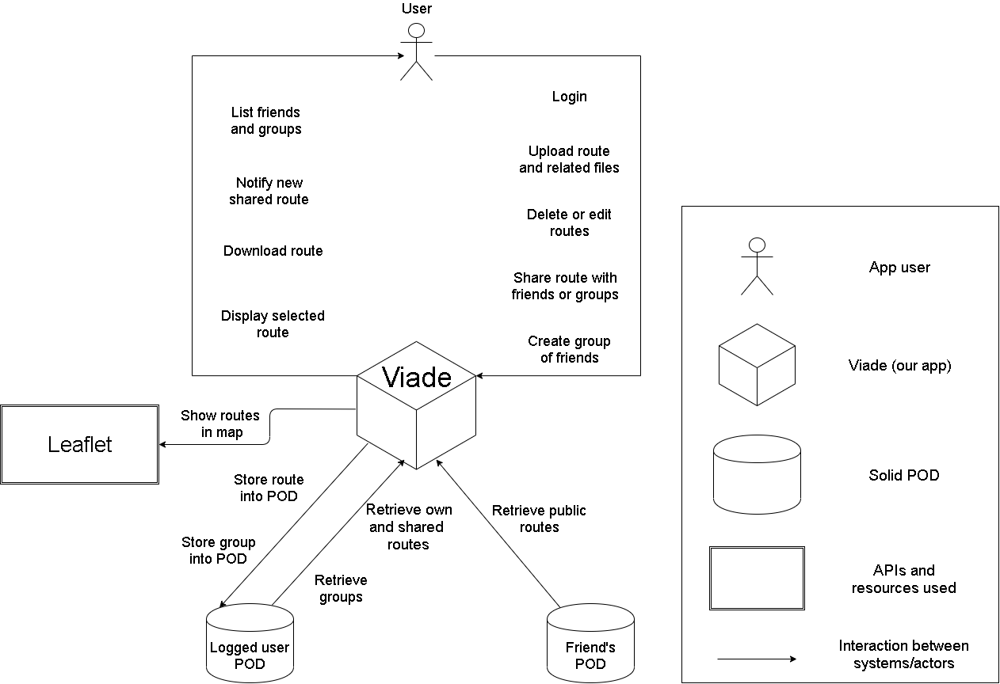

[[section-system-scope-and-context]]
== System Scope and Context

****
.Contents
The scope of our project, Viade, is to create an app where users can save their routes in order to see them later without this information going through an external server. To accomplish that, we are going to base our app on SOLID and, more specifically, in the use of PODs which will work as an internal private server, so each user will have his own POD and no one but that user will have access to the information stored there.

With Viade, users will be able to start and stop recording a route whenever they want. However, the route will only be saved if the recording is stopped and the user confirms that he wants to save that route into his POD. If that’s not the case, the data won’t be stored.

The stakeholders will be every person who wants to save some routes in order to repeat them any other day or just to have a log of his physical activity.

****

=== Business and Technical Context

****

[options="header",cols="1,2"]
|===
|Entity|Context
| User | It represents every potential user of our app, which will interact with it to perform the different options offered by Viade
| Viade | It's our app, the center of the system. All the information and processes related with the routes will pass through it
| SOLID Pod | There is one for each user and it's where they will keep all their routes and other information like friends, etc..
| Routes | GPX format files (which could be extended to KML or GeoJSON in a future) that users upload in order to see them later or share them with their friends
|===

****
