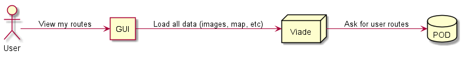

[[section-deployment-view]]

== Deployment View

Our application is a client side application which relies on SOLID specifications for the management of the user personal data.
We are deploying the app in github pages, so we depend on this service in terms of avaibility and stability.

We are developing this application using Google Chrome, so is the recommended web browser, but it should work in almost every modern browser due to the use of widely-used standards.

=== Performance
[performance]

The app is a client side app so it relies on the user device to do all the calculations needed, mainly loading and showing the map, which is not resource demanding so it should work on almost every modern device, including tablets and smartphones.

Also, the app follows the Solid specification so the internet connection and POD performance have a huge impact on the performance, specially when loading and uploding routes to the server, but also when listing friends or showing the user profile or avatar.

So, in summary, the expected perfomance relies mainly in three things:

 * The user's device performance.
 * The SOLID server hosting the POD performance.
 * As well as the client internet connection speed.

=== Infrastructure
[infrastructure]

